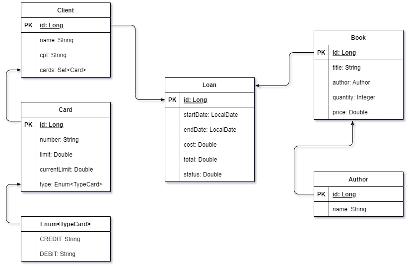

# Módulo 3 - Semana 3

Parabéns, a Lab School adorou o sistema de gestão escolar que você desenvolveu! Agora você foi chamado para desenvolver o sistema que fará a gestão dos empréstimos de livros da biblioteca.

O modelo das entidades de domínio segue abaixo:

